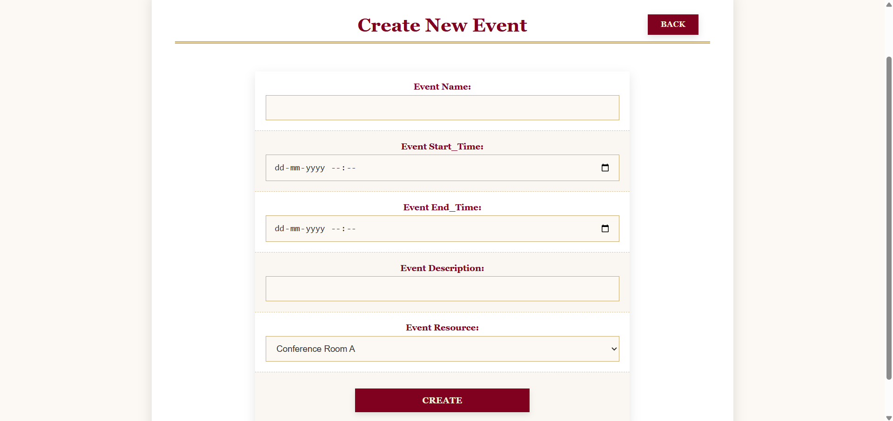
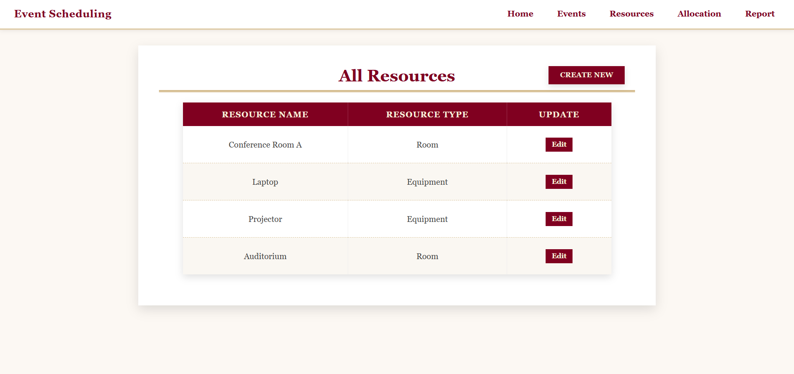
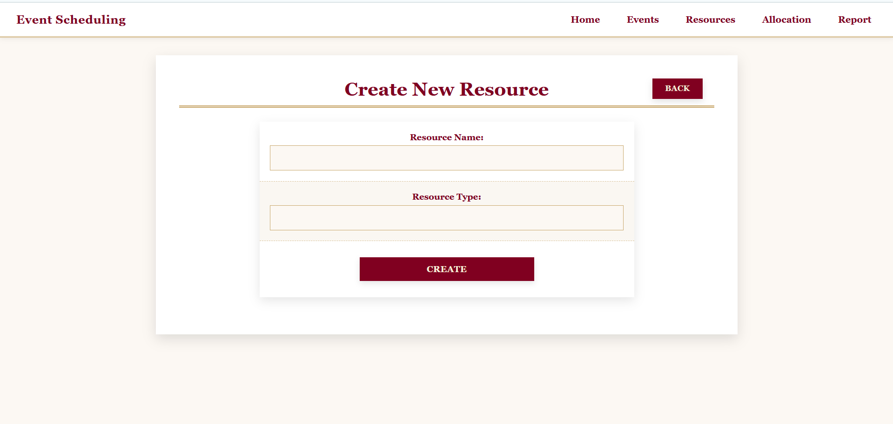
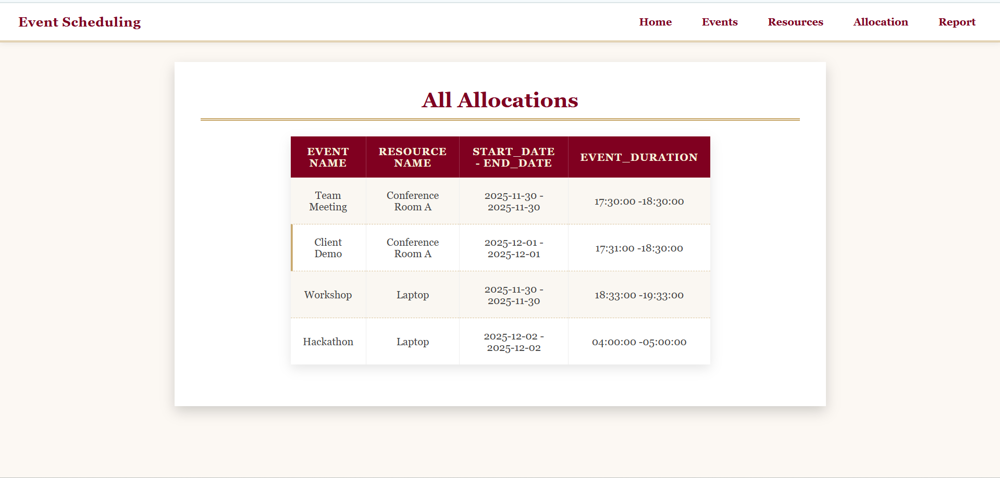
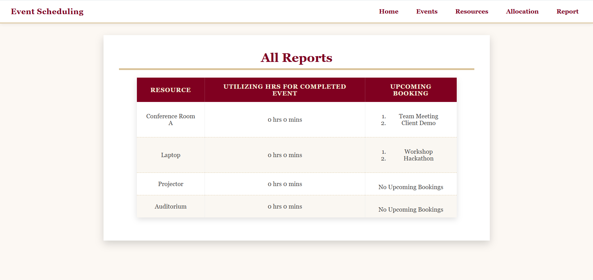

# Event_management


A web-based Event Management System built with Python Flask, SQLAlchemy, and Bootstrap.
This application allows organizations to efficiently create events, manage resources, allocate them to events, monitor schedules, and maintain real-time event reports.
---

## Table of Contents

- [Features](#features)  
- [Technologies Used](#technologies-used)  
- [Installation](#installation)  
- [Usage](#usage)  
- [Database Structure](#database-structure)  
- [Screenshots](#screenshots)  
- [Project Architecture](#project-architecture)  
- [Contributing](#contributing)  
- [License](#license)

---

## Features
-Event management: Add, update events.
-Resource management: Add, update event resources.
-Resource allocation: Assign resources to events with conflict validation.
-Dashboard: View upcoming events, allocated resources, and schedules.
-Responsive design: Works well on desktop and mobile devices.

---

## Technologies Used

- **Backend:** Python, Flask SQLAlchemy  
- **Frontend:** HTML, CSS, Bootstrap.
- **Database:** MySQL  
- **Version Control:** Git & GitHub  

---

## Installation

1. **Clone the repository:**

```
bash
git clone https://github.com/Manikandanelaiyaraj/Event_management/git.com

2. ## Create a virtual environment and activate it:
cd Event_Management_System

```
bash
python -m venv myenv
# Windows
myenv\Scripts\activate
# macOS/Linux
source myenv/bin/activate
```

3. ## Install dependencies:

```
bash
pip install -r requirements.txt
```

4. ## Run the application
```
bash
python app.py
```
5. Open your browser and go to http://127.0.0.1:5000

## Database Structure
-User: Stores user credentials (username, email, password).
-Event: Stores event details (title, start_time, end_time, description).
-Resource: Stores information about available resources (name, type).
-event_resource_allocation: Tracks which resource is allocated to which event.

## Screenshots

### Home Page


### All Events Page


### Create New Event


### Edit Event


### Resource Page


### Create Resource


### Edit Resource


### Allocation Page


### Report Page



## Contributing 

Contributions are welcome!

- Fork the repository
- Create a new branch (git checkout -b feature-name)
- Commit your changes (git commit -m 'Add feature')
- Push to the branch (git push origin feature-name)
- Create a Pull Request
